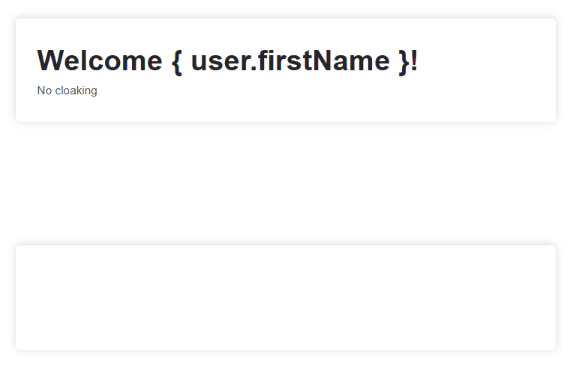

# ```rv-cloak``` binder for Rivets.js

This repository contains one solution for implementing cloaking in a Rivets.js project.

## Example

You can view and interact with a live example in [this CodePen](https://codepen.io/ralphvk/pen/RwjBoGo).



## What is meant by "cloaking"

The binder hides an element's content until Rivets.js has initialised. Otherwise, Rivets.js' binding declarations will be shown as plain text until initialisation is complete. For example, you might display the user's first name on your page using:

```html
<div class="greeting">
    <h1>Welcome { user.firstName }</h1>
</div>
```

Without cloaking, the binding declaration ```{ user.firstName }``` will be displayed as plain text, until Rivets.js is initialised and replaces it with "Bob". Using the ```rv-cloak``` binder, you can hide the element until initialisation is done, preventing the user from seeing the ugly merge tag.

## How to use

### Summary

1. Include the CSS and Javascript from [rv-cloak/rv-cloak.css](rv-cloak/rv-cloak.css) and [rv-cloak/rv-cloak.js](rv-cloak/rv-cloak.js).
2. Add the ```rv-cloak``` or ```rv-cloak-children``` attribute to cloak an element or its immediate children.

The binder has two variants: ```rv-cloak``` and ```rv-cloak-children```. The former cloaks the entire element, the latter cloaks each immediate child. The reason ```rv-cloak-children``` might be useful, is because often times the wrapper element has a background that you want to display while the page is loading. By cloaking the children instead, the parent element is not invisible.

### ```rv-cloak```

Add the ```rv-cloak``` attribute to make the element invisible until uncloaked. In this example, the entire ```<div>``` will be hidden until Rivets.js has replaced merge tags.

```html
<!-- div is hidden until merge tags replaced with values -->
<div class="greeting" rv-cloak>
    <h1>Welcome { user.firstName }</h1>
</div>
```

### ```rv-cloak-children```

Add the ```rv-cloak``` attribute to make the element invisible until uncloaked. In this example, the ```<div>``` children, in this case only ```<h1>```, will be hidden until Rivets.js has replaced merge tags.

```html
<div class="greeting" rv-cloak-children>
    <!-- h1 is hidden until merge tags replaced with values -->
    <h1>Welcome { user.firstName }</h1>
</div>
```